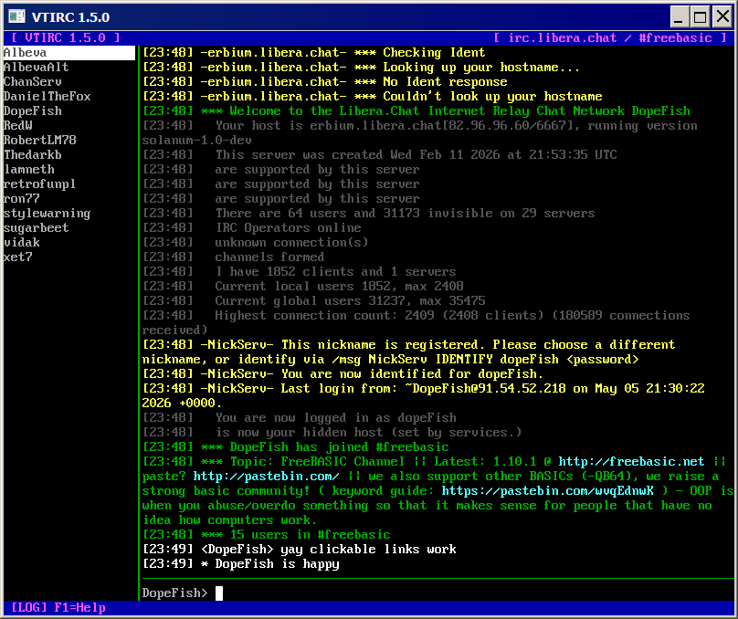

# VTIRC — A Minimalistic IRC Client

> Written in FreeBASIC with [libvt](https://github.com/rbreitinger/libvt)

---



---

## Features

- Multi-window support — channel and private message windows side by side
- mIRC colour rendering with reverse-video and formatting control codes
- Colour input shorthand (`^0`–`^15`) for styled messages
- Per-window scrollable history (ring buffer, 2000 lines per window)
- Three built-in colour schemes — Dark, Classic, Light
- Nick-colour hashing — each user gets a consistent distinct colour
- Away status (`/afk` / `/back`)
- Auto-reconnect on unexpected server drop
- Channel and PM logging to file
- Live user list with one-click PM
- In-app help — press **F1**
- Config saved automatically to `.vtirc` next to the executable
- Paste support (Shift+Ins)
- Single-file executable, no installer

---

## Building

### Requirements

| Dependency | Version | Notes |
|---|---|---|
| [FreeBASIC](https://www.freebasic.net) | 1.10.1 | Compiler |
| [libvt](https://github.com/rbreitinger/libvt) | 1.4.0+ | Place `vt/` folder next to source |

Clone or download libvt and place the `vt/` directory in your FreeBASIC `inc/` folder.

Then compile:

```sh
fbc vtirc.bas
```

The `#cmdline` directive in the source already sets optimisation and GUI-subsystem flags, so no extra compiler arguments are needed.

---

## Runtime Dependencies

| Library | Notes |
|---|---|
| SDL2 (core only) | Required by libvt at runtime |

Pre-built SDL2 binaries for Windows can be found in the
[fb-lib-archive](https://github.com/rbreitinger/fb-lib-archive/tree/main/libraries/SDL2/SDL2-2.0.14).

Place `SDL2.dll` next to the compiled executable on Windows.  
On Linux, install SDL2 via your package manager (`libsdl2-dev` / `sdl2`).

---

## License

MIT License — Copyright © 2026 Rene Breitinger

Permission is hereby granted, free of charge, to any person obtaining a copy
of this software and associated documentation files (the "Software"), to deal
in the Software without restriction, including without limitation the rights
to use, copy, modify, merge, publish, distribute, sublicense, and/or sell
copies of the Software, and to permit persons to whom the Software is
furnished to do so, subject to the following conditions:

The above copyright notice and this permission notice shall be included in all
copies or substantial portions of the Software.

THE SOFTWARE IS PROVIDED "AS IS", WITHOUT WARRANTY OF ANY KIND, EXPRESS OR
IMPLIED, INCLUDING BUT NOT LIMITED TO THE WARRANTIES OF MERCHANTABILITY,
FITNESS FOR A PARTICULAR PURPOSE AND NONINFRINGEMENT. IN NO EVENT SHALL THE
AUTHORS OR COPYRIGHT HOLDERS BE LIABLE FOR ANY CLAIM, DAMAGES OR OTHER
LIABILITY, WHETHER IN AN ACTION OF CONTRACT, TORT OR OTHERWISE, ARISING FROM,
OUT OF OR IN CONNECTION WITH THE SOFTWARE OR THE USE OR OTHER DEALINGS IN THE
SOFTWARE.
